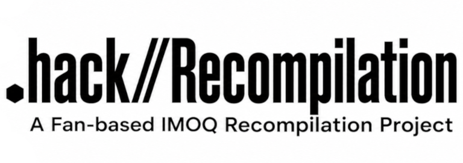

<div align="center">

<p align="center">
  
</p>

# .hack//Recompilation

### A native recompilation project for the original .hack//IMOQ quadrilogy

**INFECTION · MUTATION · OUTBREAK · QUARANTINE**

*Preserving the original PlayStation 2 experience while building a path toward native execution on modern systems.*

</div>

---

> [!IMPORTANT]
> **.hack//Recompilation is in early development and is not yet a playable replacement for the original games.**
>
> Development currently focuses on **.hack//INFECTION**. The game boots through the logo sequence and OPENING movie with working video, audio, A/V synchronization, and corrected 4:3 presentation. The next major milestones are reaching the main menu and implementing keyboard/gamepad input.

## The IMOQ Games

The project is intended to support the complete original four-game `.hack` series released for the PlayStation 2.

| Game | US Product ID | Reference Hash | Current Project Status |
|---|---|---|---|
| **.hack//INFECTION Part 1** | `SLUS-20267` | TBD | 🟡 **Active development** |
| **.hack//MUTATION Part 2** | `SLUS-20562` | TBD |➖ Not started |
| **.hack//OUTBREAK Part 3** | `SLUS-20563` | TBD | ➖ Not started |
| **.hack//QUARANTINE Part 4** | `SLUS-20564` | TBD | ➖ Not started |

## Status Legend

| Symbol | Meaning |
|:---:|---|
| ✅ | Working / verified |
| 🟡 | Partial, experimental, or currently in development |
| ❌ | Not working / not implemented |
| ➖ | Not started or not yet tested |

## Current Progress

### Per-Game Progress

| Feature | INFECTION | MUTATION | OUTBREAK | QUARANTINE |
|---|:---:|:---:|:---:|:---:|
| Recompilation target generated | ✅ | ➖ | ➖ | ➖ |
| Runtime boot / initialization | ✅ | ➖ | ➖ | ➖ |
| Initial logo sequence | ✅ | ➖ | ➖ | ➖ |
| PSS video playback | ✅ | ➖ | ➖ | ➖ |
| PSS movie audio | ✅ | ➖ | ➖ | ➖ |
| Stable movie buffering | ✅ | ➖ | ➖ | ➖ |
| Long-form A/V synchronization | ✅ | ➖ | ➖ | ➖ |
| Correct native 4:3 presentation | ✅ | ➖ | ➖ | ➖ |
| Main menu | 🟡 | ➖ | ➖ | ➖ |
| Keyboard input | ❌ | ➖ | ➖ | ➖ |
| Gamepad input | ❌ | ➖ | ➖ | ➖ |
| Playable gameplay | ➖ | ➖ | ➖ | ➖ |
| Save / load behavior | ➖ | ➖ | ➖ | ➖ |
| IMOQ save-data conversion | ➖ | ➖ | ➖ | ➖ |

## Project Goals

`.hack//Recompilation` is intended to do more than simply make the games boot. The long-term goal is to create a maintainable native recompilation of the complete IMOQ series while keeping an accurate mode for the original experience and leaving room for optional modern enhancements.

| Goal | Status |
|---|:---:|
| Accurate original 4:3 presentation | ✅ |
| Generalized PSS movie playback | 🟡 |
| Keyboard input | ❌ |
| Modern gamepad input | ❌ |
| Main-menu and gameplay compatibility | 🟡 |
| Accurate PS2 audio / RPC behavior | 🟡 |
| Eliminate temporary compatibility shims | 🟡 |
| Configurable internal resolution scaling | ➖ |
| 720p / 1080p / 1440p / 4K rendering options | ➖ |
| True widescreen rendering without stretching | ➖ |
| Widescreen-aware HUD / 2D presentation | ➖ |
| Preserve original behavior as a selectable baseline | 🟡 |

## Current Development Priorities

The immediate priorities are:

1. **Reach the INFECTION main menu.**
2. **Connect keyboard input to the PS2 pad path.**
3. **Connect modern gamepad input to the same emulated controller path.**
4. Continue from the menu into normal gameplay.
5. Generalize working systems so they can later be tested against MUTATION, OUTBREAK, and QUARANTINE.

## Building

Development currently uses the `build/app` CMake tree.

From the repository root:

```bash
cmake --build build/app \
    --target ps2EntryRunner \
    -j"$(nproc)"
```

The current INFECTION runner is:

```text
build/app/extern/PS2Recomp/ps2xRuntime/dothack-infection-recomp
```

A development run currently uses:

```bash
./build/app/extern/PS2Recomp/ps2xRuntime/dothack-infection-recomp \
    ./game/infection/SLUS_202.67
```

The project is currently developed and tested primarily on Linux.

## Project Structure

The repository is organized around a shared recompilation/runtime layer with game-specific configuration and generated code.

```text
dothack-recompilation/
├── build/
│   └── app/                 # Current application build tree
├── config/
│   ├── recomp/              # Recompiler configuration
│   └── symbols/             # Game symbol information
├── extern/
│   └── PS2Recomp/           # Project PS2Recomp fork / submodule
├── game/
│   └── infection/           # User-provided INFECTION game files
├── generated/
│   └── SLUS_202.67/         # Generated INFECTION recompilation sources
└── README.md
```

Additional game-specific directories and generated-code targets can be added as the other IMOQ titles enter development.

## PS2Recomp

This project currently uses **PS2Recomp** as its primary recompilation base.

The repository carries the project-specific PS2Recomp work as a Git submodule.

## Known Issues / Technical Debt

The project is still early and contains intentionally temporary compatibility work.

Current known issues include:

- The main menu has not yet been reached.
- Keyboard and gamepad input are not implemented.
- Current PSS A/V synchronization may discard late video frames to maintain real-time sync.

## Roadmap

### Phase 1 — INFECTION Boot Foundation

- [x] Generate and run the INFECTION recompilation target.
- [x] Establish stable EE scheduling for the current boot path.
- [x] Render the initial PS2 output.
- [x] Play logo PSS sequences.
- [x] Play the complete opening movie.
- [x] Restore opening-movie audio.
- [x] Stabilize movie streaming and buffering.
- [x] Synchronize opening audio and video.
- [x] Correct native 4:3 presentation.

### Phase 2 — Reach Playable INFECTION

- [ ] Reach the main menu.
- [ ] Implement keyboard input.
- [ ] Implement gamepad input.
- [ ] Enter normal gameplay.
- [ ] Validate core rendering during gameplay.
- [ ] Validate game audio and sound effects.
- [ ] Validate menus, fields, battles, events, and transitions.
- [ ] Validate saving and loading.

### Phase 3 — Improve Runtime

- [ ] Replace temporary compatibility shims with generalized behavior.
- [ ] Improve IOP/RPC sound emulation.
- [ ] Generalize movie playback.
- [ ] Investigate full-frame/no-drop movie synchronization.
- [ ] Reduce development-only tracing and diagnostics.
- [ ] Establish reproducible game/media verification.

### Phase 4 — Complete IMOQ Support

- [ ] Add MUTATION.
- [ ] Add OUTBREAK.
- [ ] Add QUARANTINE.
- [ ] Validate shared runtime behavior across all four games.
- [ ] Preserve inter-game save-data conversion and progression where practical.

### Phase 5 — Optional Modern Enhancements

- [ ] Configurable internal render scale.
- [ ] HD rendering presets.
- [ ] True widescreen mode.
- [ ] Widescreen HUD / UI behavior.
- [ ] Optional visual and presentation enhancements while retaining an accurate native mode.

## Game Files

**No copyrighted game data should be distributed with this repository.**

Users are expected to provide their own legally obtained game files from the original PlayStation 2 releases. Generated code, configuration, runtime work, and reverse-engineering information should be kept separate from copyrighted disc assets wherever possible.

## Legal

`.hack//Recompilation` is an independent preservation, research, and compatibility project.

`.hack`, the IMOQ games, their characters, artwork, audio, video, code, trademarks, and other original assets are the property of their respective rights holders. This project is not affiliated with or endorsed by CyberConnect2, Bandai/Bandai Namco, Sony Interactive Entertainment, or other rights holders.

The project does not aim to distribute original game disc images or copyrighted game assets.

## Credits and Acknowledgements

- **CyberConnect2** — original developer of the `.hack` games.
- **Bandai** — original publisher of the North American IMOQ releases.
- **PS2Recomp contributors** — the recompilation framework and runtime that form the technical base of this project.
- **dothacktranslate** — `.hack//Recompilation` development and project-specific PS2Recomp work.

---

<div align="center">

### .hack//Recompilation

**INFECTION · MUTATION · OUTBREAK · QUARANTINE**

</div>
